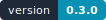
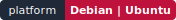

<div align="center">

# Server Toolkit

**面向 Debian / Ubuntu VPS 的中文交互式运维控制台**

以清晰的信息架构组织系统、网络、安全、服务、软件、容器与配置恢复；每一次系统修改都强调可见、可确认与可追踪。

[](VERSION)
[](https://github.com/Elainaicey/server-toolkit/actions/workflows/ci.yml)



[](LICENSE)

[快速开始](#快速开始) · [功能矩阵](#功能矩阵) · [命令参考](#命令参考) · [安全模型](#安全模型) · [项目结构](#项目结构)

</div>

---

## 项目概览

Server Toolkit 为自主管理的 Linux VPS 提供统一终端入口，覆盖从状态观察、故障定位到常规配置变更的高频工作流。

项目不追求无边界地收集脚本，而是遵循以下约束：

- **清晰分层**：系统能力优先于软件与应用，Docker 等独立应用归入应用中心。
- **单项操作**：软件一次安装、更新或移除一个条目，不提供套餐、全选和隐式依赖组合。
- **人工确认**：不存在 `--yes`、profiles 或无人值守系统修改。
- **副作用透明**：软件安装不会自动开放端口、修改 SSH 或套用网络调优模板。
- **恢复优先**：配置变更前创建清单化快照；高风险配置先验证，再加载。
- **最小运行依赖**：核心控制台使用 Bash 与 Debian/Ubuntu 标准系统工具实现。

## 快速开始

### 一键安装

root 会话：

```bash
bash <(curl -fsSL https://raw.githubusercontent.com/Elainaicey/server-toolkit/refs/heads/main/install.sh)
```

普通用户：

```bash
sudo bash -c 'bash <(curl -fsSL https://raw.githubusercontent.com/Elainaicey/server-toolkit/refs/heads/main/install.sh)'
```

安装器将程序原子部署到 `/opt/server-toolkit`，并创建 `/usr/local/bin/serverctl`。下载或暂存目录会在流程结束后自动清理。

### 启动控制台

```bash
sudo serverctl
```

控制台主导航按系统依赖层级排列：

```text
系统仪表盘 → 系统管理 → 网络与端口 → 安全中心
            → 服务与日志 → 软件管理 → 应用与容器 → 备份与恢复
```

## 功能矩阵

| 中心 | 能力 |
| --- | --- |
| **系统仪表盘** | 主机环境、负载、内存/Swap/磁盘进度、systemd 状态、TCP 监听、软件更新与 Docker 状态 |
| **系统管理** | 综合健康巡检、环境检查、资源压力、进程排行、用户会话、计划任务、重启状态、软件包更新清单、存储诊断、主机名、时区、Swap、NTP 与安全清理 |
| **网络与端口** | 接口地址、路由与策略规则、DNS 解析器与记录诊断、IPv4/IPv6 连通性、目标诊断、网卡流量、连接会话、监听端口、端口进程、BBR 与地址优先级 |
| **安全中心** | 安全基线、公网监听、UFW 状态与规则、SSH 安全向导、登录事件、Fail2ban 状态，以及带主机名匹配和到期预警的 TLS 证书检查 |
| **服务与日志** | failed/active 服务、关键词查找、服务详情与依赖、Journal、生命周期、开机启动、Timer、启动错误、内核警告与项目操作审计 |
| **软件管理** | 按分类、安装状态、ID、名称和用途浏览；查看当前版本、仓库候选版本与更新状态；单项安装、更新或移除 106 个常用软件条目 |
| **应用与容器** | Web、数据库、缓存与容器服务概览；Docker 健康检查、容器详情、日志、资源、生命周期、镜像、Compose、存储卷、网络和安全清理 |
| **备份与恢复** | 自动配置快照、手动 `/etc` 文件快照、完整性校验、当前配置差异、安全删除与单文件恢复 |

普通软件条目精确映射一个 APT 包。Docker 与 Caddy 使用各自的软件仓库流程，参考 [Docker Engine 安装文档](https://docs.docker.com/engine/install/)与 [Caddy 安装文档](https://caddyserver.com/docs/install)。

## 命令参考

### 查询与导航

```bash
serverctl status                 # 系统仪表盘
serverctl health                 # 综合系统健康巡检
serverctl doctor                 # 环境检查
serverctl updates                # 系统软件包更新清单
serverctl storage                # 存储与占用诊断
serverctl ports                  # 监听端口
serverctl dns example.com        # DNS 解析器与记录诊断
serverctl system                 # 系统管理中心
serverctl network                # 网络与端口中心
serverctl security               # 安全中心
serverctl services               # 服务与日志中心
serverctl logs nginx.service     # 直接查看服务最近日志
serverctl apps                   # 应用与容器中心
serverctl backups                # 备份与恢复中心
serverctl about                  # 版本和安装路径
serverctl version                # 版本号
sudo serverctl self-update       # 检查并原子更新项目自身
```

### 软件管理

```bash
serverctl list                   # 完整软件目录
serverctl list python            # 按关键词查询
sudo serverctl install jq        # 安装一个软件
sudo serverctl update jq         # 更新一个已安装软件
sudo serverctl remove jq         # 移除一个软件
```

`install`、`update` 与 `remove` 只接受一个软件 ID。软件中心不会批量更新整个系统；所有实际修改仍需人工确认。

### 操作预览

```bash
sudo serverctl --dry-run
sudo serverctl --dry-run install docker
```

`--dry-run` 展示将执行的系统命令，不写入配置、不安装软件，也不创建审计记录。

## 安全模型

| 边界 | 行为 |
| --- | --- |
| 权限 | 查询操作可由普通用户运行；系统修改在执行点检查 root 权限 |
| 确认 | 修改前显示目标和影响范围，默认答案为拒绝 |
| 配置备份 | 修改已有文件前写入 `/var/backups/server-toolkit/<snapshot>/` 并生成 manifest |
| SSH | 使用独立 drop-in，执行 `sshd -t`；验证或服务重启失败时恢复旧配置 |
| 防火墙 | 启用 UFW 前保留当前 SSH 端口；其他端口必须显式添加 |
| 审计 | root 修改记录到 `/var/log/server-toolkit/actions.log` |
| 安装升级 | 在同一父目录暂存并原子替换；失败时恢复上一安装目录 |
| 卸载 | 只删除能够确认属于项目的路径，不猜测性删除业务软件或系统设置 |

> [!WARNING]
> 修改 SSH、防火墙、路由或存储前，应保留 VPS 服务商控制台并创建实例快照。Docker 发布的容器端口可能绕过 UFW，需要结合云防火墙与 `DOCKER-USER` 链评估实际暴露面。

## 数据与路径

| 内容 | 默认位置 |
| --- | --- |
| 程序目录 | `/opt/server-toolkit` |
| 命令入口 | `/usr/local/bin/serverctl` |
| 配置快照 | `/var/backups/server-toolkit` |
| 操作审计 | `/var/log/server-toolkit/actions.log` |
| 项目状态 | `/var/lib/server-toolkit` |

安装器会将实际安装路径写入 `config/installation.conf`，以确保自定义路径也能被正确升级和卸载。

## 项目结构

```text
server-toolkit/
├── .gitattributes               # 跨平台文本与 LF 换行规则
├── .github/                     # CI、发布流程、社区规范与徽章资源
├── .gitignore                   # Git 忽略规则
├── bin/
│   └── serverctl                # CLI、参数解析与顶层导航
├── config/
│   └── software.tsv             # 声明式单项软件目录
├── docs/                        # 设计、变更记录与发布文档
├── scripts/
│   ├── install.sh               # 安装、原子升级与卸载
│   └── check.sh                 # 本地和 CI 检查入口
├── src/
│   ├── core/                    # 运行时、UI、平台、备份与软件目录
│   └── features/
│       ├── apps/
│       │   └── docker.sh        # Docker 独立应用实现
│       ├── system/
│       │   └── settings.sh      # 主机名、时区、Swap 与维护设置
│       └── *.sh                 # 系统、网络、安全、服务等功能中心
├── tests/                       # 离线单元测试与安全边界测试
├── install.sh                   # 稳定的一键安装引导入口
├── LICENSE                      # MIT 许可证
├── README.md                    # 项目主页
└── VERSION                      # 唯一版本来源
```

完整设计约束与扩展规范见 [`docs/DESIGN.md`](docs/DESIGN.md)，变更记录见 [`docs/CHANGELOG.md`](docs/CHANGELOG.md)，漏洞报告流程见 [`.github/SECURITY.md`](.github/SECURITY.md)，版本发布流程见 [`docs/RELEASE.md`](docs/RELEASE.md)。

## 支持范围

| 系统 | 版本 |
| --- | --- |
| Debian | 11 / 12 / 13 |
| Ubuntu | 22.04 LTS / 24.04 LTS |
| 架构 | amd64 / arm64 |
| Init | systemd |

当前不提供 RHEL 系、Alpine、非 systemd 系统或衍生发行版的兼容承诺。

## 更新

在控制台中选择“系统管理 → 更新本项目”，或直接运行：

```bash
sudo serverctl self-update
```

也可以重新运行安装命令完成原子升级：

```bash
bash <(curl -fsSL https://raw.githubusercontent.com/Elainaicey/server-toolkit/refs/heads/main/install.sh)
```

软件中心中的“更新”只更新当前选中的软件，不会升级整个系统。

## 卸载

```bash
sudo serverctl uninstall
```

卸载模式：

1. **仅卸载程序**：删除程序目录和项目命令入口，保留日志与配置快照。
2. **彻底清除项目数据**：额外删除项目日志、快照和状态目录。

通过 Server Toolkit 安装的软件，以及主机名、SSH、UFW、Swap 等系统状态不会被自动删除或猜测性回滚。需要恢复配置时，应先从备份中心选择明确快照。

## 开发

```bash
git clone https://github.com/Elainaicey/server-toolkit.git
cd server-toolkit
bash scripts/check.sh
```

开发检查需要 Bash 与 Python 3.8+；推荐安装 ShellCheck 和 yamllint，以获得与 CI 一致的完整结果。

检查流程分为 `repository-files`、`shell` 和 `tests` 三个独立任务。所有 Git 跟踪文件必须归入明确类别，并接受 UTF-8、LF、尾随空白和 Git 属性检查；Markdown、工作流 YAML、SVG、软件目录、许可证与版本元数据还会执行对应的专项验证。未归类的新文件会直接使 CI 失败。贡献要求见 [`.github/CONTRIBUTING.md`](.github/CONTRIBUTING.md)。

## 许可证

Server Toolkit 依据 [MIT License](LICENSE) 开放源代码。你可以自由使用、修改与分发本项目，但必须保留原始版权声明和许可证文本。

---

<div align="center">
  <sub>Server Toolkit 0.1.0 · Built for deliberate VPS operations</sub>
</div>
